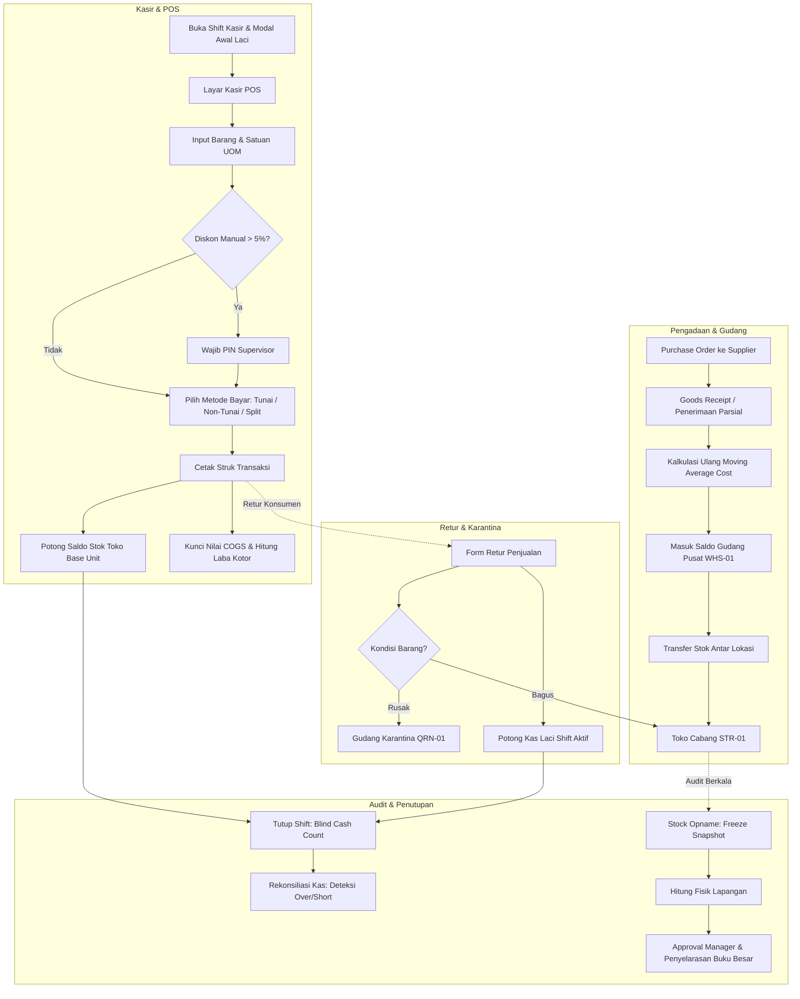

# AdaStock
### Enterprise Retail Inventory & Point of Sale (POS) Management System
> **Solusi Manajemen Inventori Retail & POS Terintegrasi Berbasis Buku Besar Stok Atomik (*Stock Ledger*) untuk Menghilangkan Selisih Barang, Mencegah Kecurangan Kasir, dan Memaksimalkan Profitabilitas Bisnis Retail.**


-success?style=for-the-badge&logo=checkmarx&logoColor=white)

---

## 💡 Permasalahan Nyata yang Dijawab oleh AdaStock
Di banyak bisnis retail, minimarket, dan toko grosir, pengelolaan inventori barang dan operasional kasir masih sering mengalami kebocoran finansial, selisih fisik yang misterius, manipulasi diskon/pembatalan struk, serta kebingungan menghitung laba bersih akibat Harga Pokok Penjualan (HPP) yang tidak akurat. Penggunaan software kasir mandiri (*standalone POS*) yang terpisah dari gudang memicu berbagai kerugian operasional:

| Tantangan Operasional Tradisional | Solusi Terpadu yang Dihadirkan AdaStock |
|---|---|
| **Selisih Stok Misterius & Mutasi Gaib**<br>Stok di sistem sering tidak cocok dengan fisik rak akibat perubahan langsung via edit manual tanpa bukti riwayat. | **Engine Buku Besar Stok Atomik (*Immutable Stock Ledger*)**<br>Tidak ada manipulasi saldo sepihak. Setiap penambahan atau pengurangan wajib tercatat dalam buku besar (*Stock Movement*) lengkap dengan referensi transaksi, waktu, lokasi, dan pengguna. |
| **Kecurangan Pembatalan Struk & Diskon Liar**<br>Kasir membatalkan transaksi setelah pembeli pergi atau memberi diskon sepihak untuk mengantongi selisih uang tunai. | **Supervisor PIN Guard & Otorisasi Bertingkat**<br>Aksi sensitif seperti pembatalan (*Void Sale*) atau diskon manual di atas batas kewenangan (> 5% / Rp 20.000) wajib diotorisasi langsung dengan PIN Supervisor/Manager. |
| **Uang Laci Kasir Minus / Fraud Kasir**<br>Pemilik toko tidak tahu berapa uang fisik yang seharusnya ada di laci kasir saat pergantian shift. | **Siklus Shift Kasir & Rekonsiliasi Kas Laci (*Z-Report*)**<br>Wajib input modal awal (*Opening Cash*), pencatatan arus kas laci otomatis per struk, serta penghitungan uang fisik buta (*Blind Cash Count*) saat tutup shift untuk mendeteksi selisih (*over/short*). |
| **Retur Barang Rusak Tercampur Barang Bagus**<br>Barang cacat/kedaluwarsa yang dikembalikan konsumen sering kembali terpajang di rak toko dan terjual ulang ke pelanggan lain. | **Dual-Destination Smart Sales Return Routing**<br>Pemisahan rute fisik otomatis: barang kondisi bagus langsung dikembalikan ke rak toko (`STR-01`), sedangkan barang rusak diisolasi ke Gudang Karantina Rusak (`QRN-01`). |
| **HPP Tidak Akurat & Laba Fiktif**<br>Harga beli dari supplier selalu berubah-ubah, membuat estimasi laba kotor toko menjadi meleset dan tidak mencerminkan margin riil. | **Real-Time Moving Average Costing (MAC) Engine**<br>HPP dihitung ulang secara otomatis saat barang masuk dari supplier dan dikunci secara permanen pada setiap struk penjualan untuk pelaporan laba kotor yang presisi. |
| **Stock Opname Berhari-hari & Mengganggu Operasional**<br>Proses audit fisik menyita waktu berhari-hari, rentan salah hitung, dan sulit mendeteksi di mana titik kebocoran stok. | **Freeze Snapshot Stock Opname & Penyelarasan Otomatis**<br>Pembekuan snapshot saldo sistem secara instan, pencatatan hitungan fisik bertahap di lapangan, deteksi deviasi moneter live, serta penyesuaian otomatis ke buku besar saat disetujui. |

---

## ✨ 5 Nilai Jual & Keunggulan Utama (Core Value Proposition)

### 1. 📦 Engine Buku Besar Stok Atomik (*Immutable Stock Movement Ledger*) & Multi-Satuan (UOM)
- **Prinsip Akuntansi Finansial pada Inventori**: Seluruh mutasi kuantitas dicatat berpasangan layaknya jurnal debet-kredit (*Stock Movement*), lengkap dengan tipe pergerakan: `PURCHASE_RECEIPT`, `SALE`, `SALE_VOID`, `SALES_RETURN`, `PURCHASE_RETURN`, `STOCK_ADJUSTMENT`, dan `STOCK_OPNAME`.
- **Hierarki Multi-Satuan Otomatis (UOM)**: Mendukung penjualan dan pembelian bertingkat (misal: Karton / Dus / Pak / Pcs). Seluruh saldo inventori disimpan dalam satuan dasar terkecil (*Base Unit*), sehingga tidak akan pernah terjadi salah hitung konversi satuan di rak gudang.

### 2. 🛡️ Sistem Otorisasi Bertingkat & Supervisor PIN Guard (Anti-Fraud Kasir)
- **Pencegahan Fraud di Titik Kasir**: Kasir hanya berwenang melayani transaksi standar. Diskon promo manual yang melebihi batas toleransi wajar dan pembatalan transaksi (*Void*) setelah struk terbit langsung memicu modal otorisasi PIN Supervisor.
- **Audit Log Terintegrasi**: Setiap transaksi yang dibatalkan tersimpan permanen di tabel audit log lengkap dengan alasan pembatalan, kasir pemohon, dan supervisor pemberi otorisasi.

### 3. 🏪 Dual-Destination Smart Sales Return Routing (Toko vs Karantina Rusak)
- **Integritas Kualitas Barang Terjaga**: Saat konsumen meretur barang belanjaan, sistem memfasilitasi pilihan kondisi:
  - **Barang Bagus/Layak Jual**: Saldo stok langsung dikembalikan ke Toko (`STR-01`).
  - **Barang Rusak/Cacat/Expired**: Stok fisik langsung diarahkan ke Gudang Karantina (`QRN-01`) agar tidak dapat dipindai ulang oleh kasir, siap untuk dimusnahkan (*Write-off*) atau diklaim retur ke supplier.
- **Pengembalian Dana Kas Laci Otomatis**: Refund uang tunai secara otomatis memotong saldo kas laci shift kasir yang sedang aktif dan dicatat ke dalam audit penutupan shift.

### 4. 💵 Siklus Shift Kasir Terpadu & Rekonsiliasi Kas Laci (*Blind Cash Count Z-Report*)
- **Ketertiban Kasir Berbasis Register**: Kasir tidak dapat memproses transaksi apa pun di layar POS sebelum membuka shift dan mencatat modal awal kasir (*Starting Cash Drawer*).
- **Audit Selisih Kas (*Over/Short*)**: Saat kasir menutup shift, kasir memasukkan jumlah fisik uang kertas/koin di laci secara buta. Sistem menghitung estimasi kas seharusnya ($\text{Modal Awal} + \text{Penjualan Tunai} - \text{Refund Tunai}$) dan mencatat selisih defisit atau surplus secara transparan di laporan slip Z-Report.

### 5. 📊 Real-Time Financial Analytics, Analisis Margin Laba Kotor & Valuasi Aset Stok
- **Laporan Penjualan Komprehensif**: Pantau omset kotor (*Gross Sales*), diskon, transaksi void, refund retur, hingga omset bersih (*Net Sales*), serta breakdown metode pembayaran (Tunai, QRIS, Debit, Kredit, Transfer, E-Wallet).
- **Analisis Laba Kotor & Kontribusi Margin**: Mengidentifikasi Top 10 Produk Terlaris (*Best Sellers by Qty*) dan Top 10 Produk Penghasil Margin Laba Tertinggi (*Top Profit Contributors*).
- **Valuasi Nilai Aset Stok**: Mengetahui total nilai aset modal barang berjalan per lokasi gudang/toko berbasis Moving Average Cost, serta pemisahan nilai kerugian barang tertahan di Karantina.
- **Ekspor Data CSV Instan**: Dilengkapi dukungan encoding UTF-8 BOM untuk kompatibilitas langsung tanpa corrupt saat dibuka di Microsoft Excel.

---

## 🎯 Peran Pengguna & Solusi Spesifik yang Didapatkan

```text
+---------------------------------------------------------------------------------------------------+
|                                       ADASTOCK WORKSPACE                                          |
+------------------------------+------------------------------------+-------------------------------+
| 👤 KASIR (Cashier)           | 👔 MANAGER (Store Supervisor)      | 🛡️ SUPER ADMIN (Owner/Head)   |
+------------------------------+------------------------------------+-------------------------------+
| • Buka/tutup shift laci kas  | • Otorisasi PIN Void & Diskon Kasir| • Kelola akun pengguna & role |
| • Operasional POS cepat      | • Buat & setujui Stock Opname fisik| • Konfigurasi toko & gudang   |
| • Pilihan multi-satuan (UOM) | • Audit rekonsiliasi kas laci kasir| • Master data produk & vendor |
| • Split payment (Tunai/QRIS) | • Approval transfer stok barang    | • Pengadaan (Purchase Orders) |
| • Tahan/Panggil keranjang    | • Laporan penjualan & laba kotor   | • Penerimaan barang gudang    |
| • Cetak struk kasir thermal  | • Analisis valuasi aset inventori  | • Audit trail & sistem logs   |
+------------------------------+------------------------------------+-------------------------------+
```

### 👤 1. Kasir (Cashier) — Fokus: Kecepatan Transaksi & Akurasi Laci Kas
- **Daya Tarik**: Tampilan POS yang intuitif, mendukung pencarian barcode instan, konversi satuan otomatis (Pcs, Lusin, Dus), dan fitur *Hold & Recall Cart* saat pembeli ingin mengambil barang tambahan tanpa membuat antrean macet.
- **Dampak**: Layanan di kasir menjadi super cepat, risiko salah hitung uang kembalian hilang, dan modal uang laci kasir terlacak akurat tanpa rasa was-was saat pergantian shift.

### 👔 2. Manager (Store Supervisor) — Fokus: Pengawasan & Otorisasi Pencegahan Fraud
- **Daya Tarik**: Kendali penuh atas tindakan sensitif staf kasir melalui PIN Supervisor 6-digit. Akses langsung ke laporan rekonsiliasi kas laci per shift dan eksekusi audit stock opname berkala dengan live variance monitoring.
- **Dampak**: Mencegah kebocoran finansial di toko, memastikan stok fisik selalu sinkron dengan sistem, serta menjamin integritas uang setoran harian.

### 🛡️ 3. Super Administrator (Owner / Head of Inventory) — Fokus: Strategi Bisnis & Finansial
- **Daya Tarik**: Visibilitas menyeluruh atas seluruh aset multi-gudang dan toko. Dapat memantau laba kotor murni harian, margin per kategori/brand produk, perputaran pengadaan supplier, dan riwayat audit trail lengkap.
- **Dampak**: Mengambil keputusan pengadaan dan promo diskon berbasis data akurat (*data-driven*), meminimalisir stok mati (*dead stock*), dan memaksimalkan profit margin perusahaan.

---

## 🔄 Siklus Hidup & Alur Bisnis Terintegrasi



---

## 🛠️ Tumpukan Teknologi (Technology Stack)

AdaStock dibangun menggunakan arsitektur monolitik modern yang kokoh, cepat, dan mudah dipelihara:

- **Backend Framework**: **Laravel 13** (PHP 8.3+) — Menerapkan prinsip *MVC & Clean OOP Architecture*, *Thin Controllers*, *Service-Action Layer*, *Form Request Validations*, dan *Backed Enums*.
- **Frontend & Reaktivitas**: **Blade Engine + Alpine.js** — Interaksi antarmuka yang gesit dan reaktif (pencarian katalog produk, kalkulasi keranjang belanja, split payment modal) tanpa beban kompleksitas bundler SPA.
- **Desain & UI**: **Tailwind CSS** — Antarmuka modern bernuansa *Clean Corporate* berstandar tinggi (anti-AI slop), tipografi rapi (*Inter*), transisi halus, serta *Print-Ready CSS* untuk cetak struk thermal 58mm/80mm dan laporan PDF.
- **Mesin Basis Data**: **PostgreSQL Ready / SQLite / MySQL** — Skema relasional yang ternormalisasi ketat, tipe data `decimal(15, 2)` untuk kalkulasi moneter presisi, serta *Foreign Key Cascade Rules* yang aman.
- **Kualitas & Pengujian Otomatis**: **PHPUnit Feature Testing Suite** — Dilengkapi **101 Feature Tests** (420 Assertions) yang mencakup seluruh alur checkout, multi-satuan, otorisasi PIN, stock opname, hingga kalkulasi laporan laba kotor dengan tingkat kelulusan **100% Hijau**.

---

## 🏆 Mengapa AdaStock Pilihan Terbaik untuk Bisnis Retail Anda?

1. **Struktur Multi-Lokasi Siap Pakai**: Mendukung konfigurasi Gudang Distribusi Pusat (`WHS-01`), Toko Retail Cabang (`STR-01`), dan Gudang Karantina Barang Rusak (`QRN-01`).
2. **Audit Trail Lengkap & Terverifikasi**: Tidak ada celah data hilang atau angka stok fiktif. Setiap perubahan saldo barang dan arus uang fisik laci kasir tercatat runut dan dapat dipertanggungjawabkan.
3. **Perhitungan Laba Kotor yang Sebenarnya**: Bukan sekadar mencatat omset penjualan, AdaStock menghitung laba bersih kotor berdasarkan HPP bergerak (*Moving Average Costing*) riil pada saat barang tersebut terjual.
4. **Keamanan Finansial Terjamin**: Melindungi pemilik bisnis dari potensi manipulasi diskon liar, pembatalan sepihak, dan selisih kas kasir lewat mekanisme otorisasi PIN Supervisor.

---

## 🚀 Panduan Instalasi & Menjalankan Cepat (Quick Start Guide)

### Prasyarat Sistem
- **PHP** >= 8.3 (dengan ekstensi `pdo`, `pdo_sqlite` / `pdo_pgsql` / `pdo_mysql`, `bcmath`, `mbstring`, `gd`)
- **Composer** >= 2.x
- **Node.js** >= 18.x & **NPM**

### Langkah Instalasi

1. **Clone Repositori**:
   ```bash
   git clone https://github.com/Kumarafws/AdaStock-POS.git
   cd AdaStock-POS
   ```

2. **Pasang Dependensi**:
   ```bash
   composer install
   npm install
   ```

3. **Konfigurasi Environment**:
   Salin file konfigurasi environment:
   ```bash
   cp .env.example .env
   php artisan key:generate
   ```

   *(Secara default aplikasi menggunakan SQLite `database/database.sqlite`. Jika ingin menggunakan PostgreSQL atau MySQL, sesuaikan nilai `DB_CONNECTION` pada file `.env`).*

4. **Migrasi & Isi Data Awal (Seeding)**:
   ```bash
   php artisan migrate:fresh --seed
   ```

5. **Kompilasi Aset Frontend**:
   ```bash
   npm run build
   ```

6. **Jalankan Aplikasi**:
   ```bash
   php artisan serve
   ```
   Akses aplikasi melalui browser di: **[http://localhost:8000](http://localhost:8000)**

---

### 🔑 Akun Login Bawaan (Default Credentials)

Semua akun default menggunakan kata sandi (password): **`password`**

| Role | Username | Password | PIN Otorisasi Supervisor | Hak Akses Utama |
|---|---|:---:|:---:|---|
| 🛡️ **Super Administrator** | `admin` | `password` | `123456` | Kontrol penuh sistem, manajemen pengguna, supplier, produk, pengadaan, dan audit. |
| 👔 **Store Manager** | `manager` | `password` | `123456` | Otorisasi void/diskon kasir, approval stock opname fisik, dan laporan finansial. |
| 👤 **Kasir (Cashier)** | `cashier` | `password` | *-* | Buka/tutup register shift kasir, transaksi POS, retur konsumen, dan cetak struk. |

---

### 🧪 Menjalankan Pengujian Otomatis (Automated Tests)

Pastikan seluruh fitur sistem berjalan sempurna dengan menjalankan test suite komprehensif:

```bash
php artisan test
```

Hasil verifikasi: **101 Tests Passed, 420 Assertions, 0 Failures, 0 Errors (100% Green)**.

---

<p align="center">
  <b>AdaStock</b> — Menghubungkan Pengadaan, Gudang, dan Kasir dalam Satu Ketepatan Stok yang Akuntabel dan Menguntungkan.
</p>
